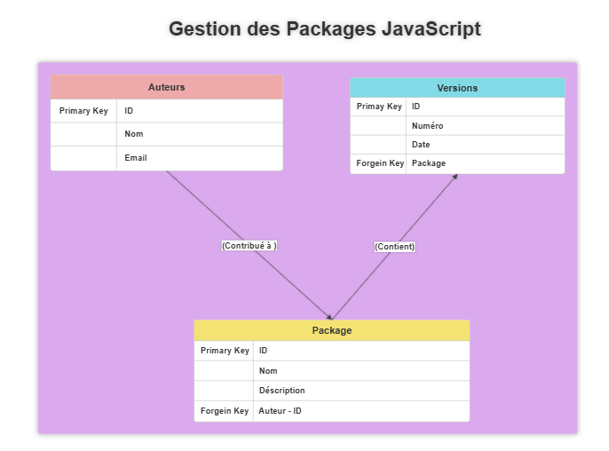
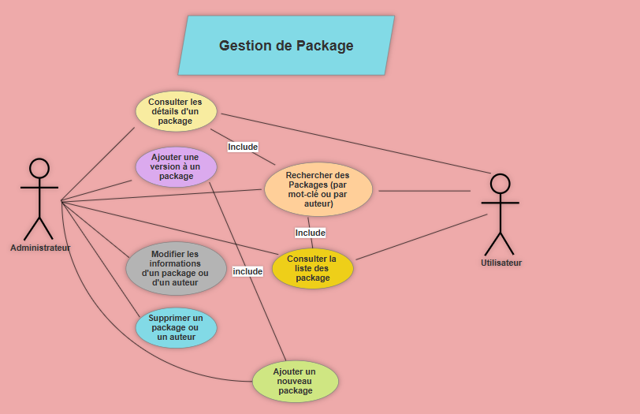

# Jihane-elmajdi-packages

# Gestion des Packages JavaScript

Une application web conçue pour moderniser et centraliser la gestion des packages JavaScript et de leurs auteurs. Ce projet vise à simplifier la gestion des versions.

## Table des Matières

1. [Contexte](#contexte)
2. [Schéma de la Base de Données](#schéma-de-la-base-de-données)
3. [Diagramme UML - Cas d'Utilisation](#diagramme-uml---cas-dutilisation)
4. [Installation et Configuration](#installation-et-configuration)
5. [Scripts SQL](#scripts-sql)
6. [Fonctionnalités en PHP](#fonctionnalités-en-php)

---

## Contexte

Actuellement, les informations sur les packages et leurs auteurs sont dispersées, ce qui complique leur gestion. Ce projet propose une application web pour :

- Gérer les packages : ajout, mise à jour, suppression et gestion des versions.
- Gérer les auteurs : ajout, modification, suppression et association aux packages.
- Rechercher facilement : recherche de packages par auteur ou par mot-clé.

---

## Schéma de la Base de Données

### Entités et Relations

#### Packages

- **Attributs** : `ID` (clé primaire), `Nom`, `Description`, `Auteur_ID` (clé étrangère).
- **Relation** : Un package peut être lié à un auteur et à plusieurs versions.

#### Versions

- **Attributs** : `ID` (clé primaire), `Numéro`, `Date`, `Package_ID` (clé étrangère).
- **Relation** : Une version est associée à un package (relation plusieurs-à-un).

#### Auteurs

- **Attributs** : `ID` (clé primaire), `Nom`, `Email`.
- **Relation** : Un auteur peut contribuer à plusieurs packages.

#### Diagramme ERD

Le schéma ci-dessous présente la structure des entités et leurs relations :

- **Auteurs** : Liés aux packages par l'attribut `Auteur_ID`.
- **Packages** : Liés aux versions et auteurs.
- **Versions** : Reliées à des packages via `Package_ID`.
  

---

## Diagramme UML - Cas d'Utilisation

Le diagramme ci-dessous illustre les interactions entre les utilisateurs et le système :

### Acteurs Principaux

- **Administrateur** :
  - Ajouter un nouveau package.
  - Ajouter une version à un package.
  - Modifier ou supprimer des informations sur un package ou un auteur.
- **Utilisateur** :

  - Rechercher des packages (par mot-clé ou auteur).
  - Consulter les détails des packages et auteurs.

  

### Principales Fonctionnalités

1. Consulter la liste des packages.
2. Rechercher des packages par auteur ou mot-clé.
3. Ajouter ou modifier des packages.
4. Gérer les auteurs.

---

## Installation et Configuration

### Pré-requis

- **Serveur Web** : Apache.
- **PHP** : Version 7.4 ou supérieure.
- **MySQL** : Pour la base de données.
- **Éditeur de Code** : Visual Studio Code ou autre.

### Étapes d'Installation

1. Clonez le dépôt GitHub :

   ```bash
   git clone https://github.com/Youcode-Classe-E-2024-2025/Jihane-elmajdi-packages
   ```

2. Configurez la base de données :

   - Ouvrez phpMyAdmin ou un terminal MySQL.
   - Exécutez le script SQL situé dans `/sql/database.sql`.

3. Configurez la connexion à la base de données :
   - Rendez-vous dans `includes/connect.php`.
   - Modifiez les détails comme suit :
     ```php
     $host = 'localhost';
     $port = '';  // Pas de port pour XAMPP
     $dbname = 'gestion_packages';  // Nom de la base
     $user = 'root';  // Utilisateur MySQL
     $password = '';  // Mot de passe (vide pour XAMPP)
     ```

---

## Scripts SQL

Les scripts SQL incluent :

1. La création de la base de données et des tables.
2. L'insertion de données factices pour les tests.
3. Les requêtes pour gérer les entités (SELECT, INSERT, DELETE).

---

## Fonctionnalités en PHP

- Gestion des utilisateurs (CRUD).
- Gestion des packages et versions (CRUD).

---
